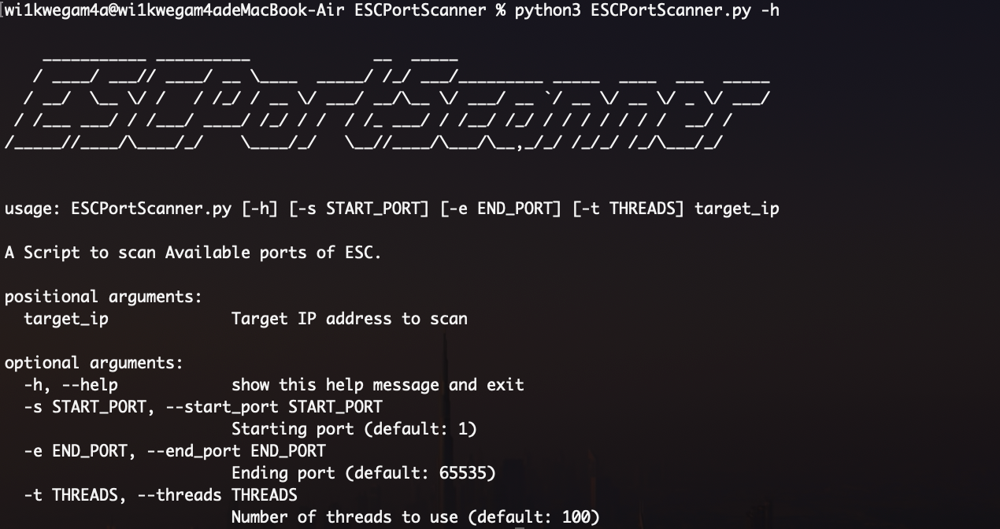
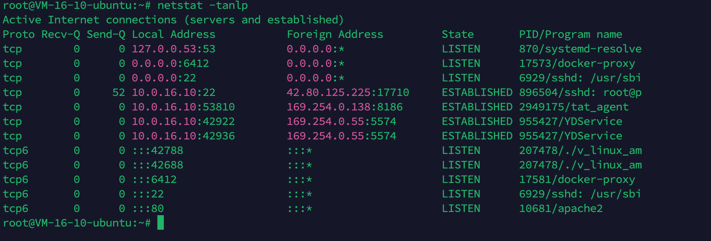
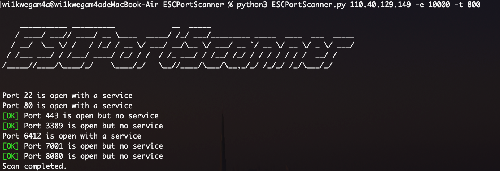

# ESCPortScanner
如果想在一个ESC（如阿里云、腾讯云服务器）上面的某个端口开启服务，安全起见，需要找到那些防火墙放行且并未开启服务的端口，此时可使用本工具进行可用端口扫描。



使用方法：

```
python3 ESCPortScanner.py [-h] [-s START_PORT] [-e END_PORT] [-t THREADS] target_ip
```

参数意义：

- -h：打印帮助信息
- -s：确定扫描开始的端口（默认为1）
- -e：确定扫描结束的端口（默认为65535）
- -t：确定扫描使用的线程数（默认为100），线程数越多速度越快但可能造成电脑卡顿。我的电脑最大线程数可以设置为2000+。

Example：

TX云某台服务器的防火墙设置如下：


此时开启服务的端口有22、80、6412、42688，剩下的端口虽然防火墙放行但并未开启服务：



此时我们运行ESCPortScanner去判断哪些端口**被放行但未开启服务**：


